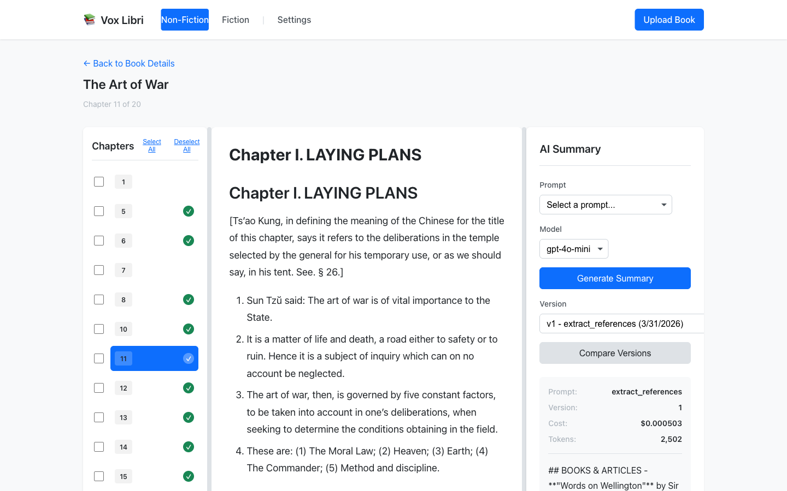
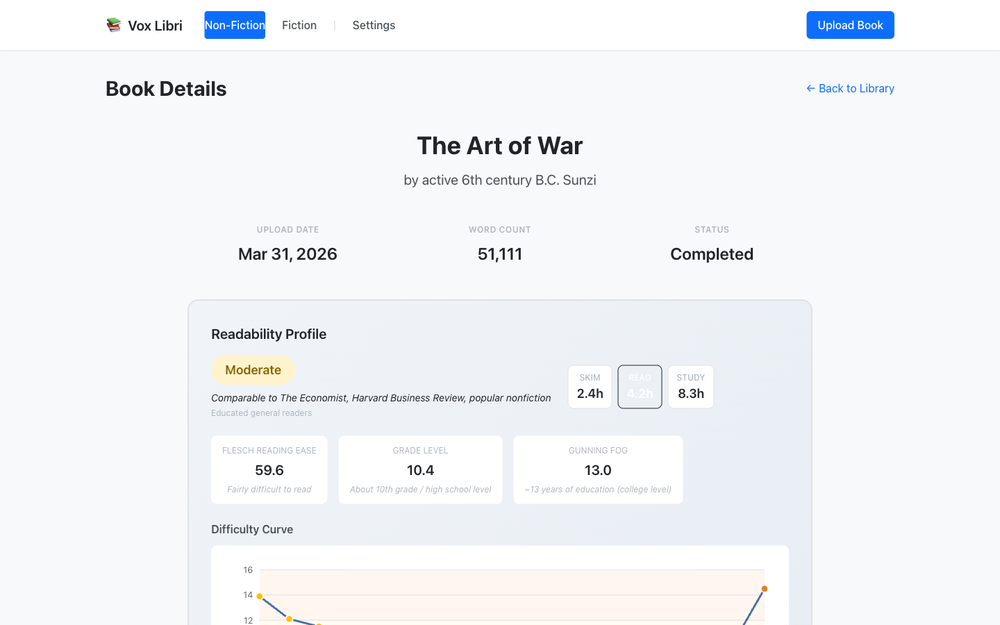
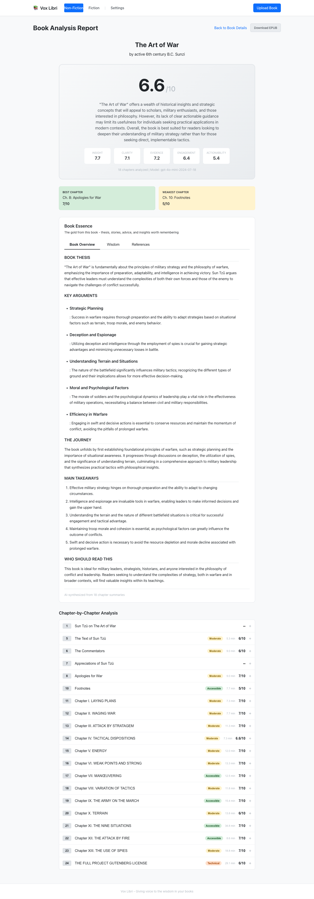
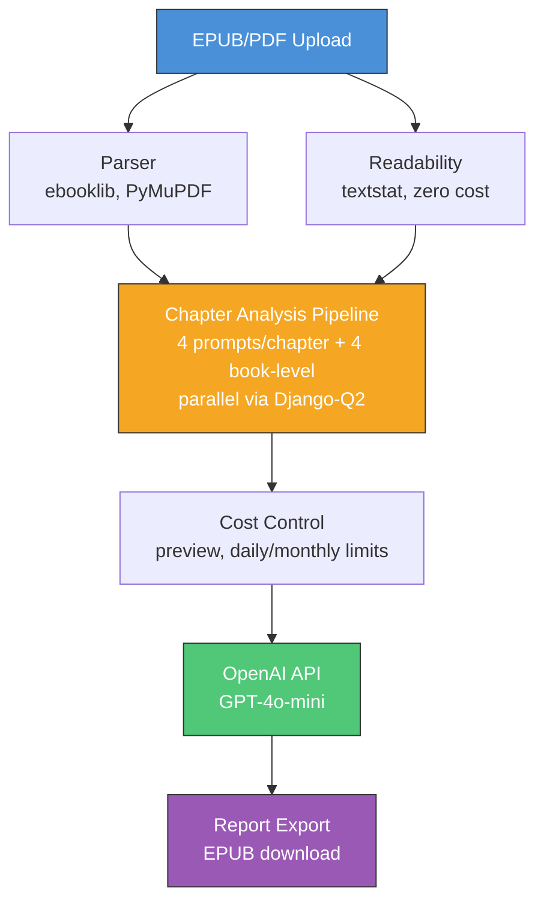

<p align="center">
  
</p>

<h1 align="center">VoxLibri</h1>

<p align="center">
  <em>AI-powered book comprehension platform. Upload EPUBs, read in a 3-column interface, generate chapter summaries with cost controls, and export full analysis reports.</em>
</p>

<p align="center">
  
  
  
  
</p>

---

## What It Does

VoxLibri turns books into structured knowledge. Upload an EPUB, and the platform:

1. **Parses** the book into chapters with smart TOC detection
2. **Analyzes readability** locally (zero API cost) -- Flesch score, grade level, difficulty curve
3. **Generates AI summaries** per chapter using customizable prompts
4. **Aggregates book-level analysis** -- thesis, key arguments, ratings, wisdom extraction
5. **Exports** the full analysis as a downloadable EPUB report

Every AI call shows a cost preview before execution. Daily and monthly spending limits prevent surprises.

---

## Screenshots

<p align="center">
  
  <br><em>3-column reading interface: chapter navigation, text content, AI summary panel with cost tracking</em>
</p>

<p align="center">
  
  <br><em>Book detail with readability profile -- difficulty tier, reading time estimates, Flesch/Gunning Fog scores, difficulty curve</em>
</p>

<p align="center">
  
  <br><em>Full analysis report for The Art of War -- rating, thesis, key arguments, chapter-by-chapter breakdown with difficulty badges</em>
</p>

---

## Architecture



### Key Design Decisions

- **Services layer** -- business logic lives in `books_core/services/`, not views
- **Cost-first** -- every AI call requires a preview showing token count and cost before execution
- **Local-first readability** -- Flesch, Gunning Fog, SMOG, Coleman-Liau computed via textstat with zero API calls
- **Parallel processing** -- Django-Q2 runs 4 workers for concurrent chapter analysis
- **Prompt templates** -- stored as markdown with YAML frontmatter in `prompts/`, synced on startup

---

## AI Analysis Pipeline

The analysis pipeline processes a book in two phases:

**Phase 1: Per-Chapter** (4 prompts each, parallel across chapters)
- `summarize_chapter` -- structured summary with key points
- `rate_chapter` -- quality rating with criteria breakdown
- `extract_chapter_wisdom` -- actionable insights and quotes
- `extract_references` -- books, articles, and people mentioned

**Phase 2: Book-Level Aggregation** (4 prompts, sequential)
- `aggregate_summaries` -- thesis, key arguments, journey, takeaways
- `aggregate_book_rating` -- overall rating with sub-scores
- `aggregate_wisdom` -- consolidated wisdom across all chapters
- `aggregate_references` -- deduplicated bibliography

**Readability** (runs before AI, zero cost):
- Flesch Reading Ease, grade level, Gunning Fog, SMOG, Coleman-Liau
- Difficulty tier classification (accessible / moderate / technical / dense)
- Per-chapter difficulty curve visualization
- Estimated reading times (skim / read / study)

---

## Quick Start

```bash
git clone https://github.com/neilgilleran/voxlibri.git
cd voxlibri
python -m venv .venv
source .venv/bin/activate  # Windows: .venv\Scripts\activate
pip install -r requirements.txt

cp .env.example .env
# Edit .env: add your OPENAI_API_KEY

python manage.py migrate
python manage.py createsuperuser

# Two terminals required:
python manage.py runserver      # Terminal 1: web server
python manage.py qcluster       # Terminal 2: task worker (required for AI)
```

Open http://localhost:8000

Get an OpenAI API key at https://platform.openai.com/api-keys

---

## Usage

1. **Upload** -- click "Upload Book", select EPUB or PDF (max 50MB)
2. **Browse** -- library shows covers, readability badges, word counts
3. **Read** -- 3-column interface: chapters left, text center, AI panel right
4. **Summarize** -- select a prompt, click "Generate Summary" (cost preview shown first)
5. **Analyze** -- "Analyze Book" runs the full pipeline across all chapters
6. **Report** -- view the aggregated analysis with ratings, thesis, wisdom
7. **Export** -- download the complete analysis as an EPUB report

### Cost Controls

| Setting | Default | Description |
|---------|---------|-------------|
| Monthly limit | $5.00 | Resets on the 1st of each month |
| Daily limit | 100 summaries | Resets at midnight UTC |
| Preview | Always on | Every AI call shows cost before confirmation |

---

## Prompt System

AI prompts are stored as markdown files with YAML frontmatter:

```markdown
---
name: summarize_chapter
category: summarization
default_model: gpt-4o-mini
variables: [content]
---
# IDENTITY
You are an expert book analyst...
```

Prompts live in `prompts/` and auto-sync on server startup. Supports [Fabric](https://github.com/danielmiessler/fabric) prompt patterns -- run `python manage.py sync_prompts` to pull from the Fabric library.

---

## Project Structure

```
voxlibri/
├── books_core/              # Main Django app
│   ├── models.py            # Book, Chapter, Summary, Prompt, UsageTracking
│   ├── views.py             # Library, Detail, Upload, Settings views
│   ├── summary_api_views.py # Summary generation API
│   ├── book_analysis_views.py
│   ├── chapter_pipeline_views.py
│   ├── services/            # Business logic
│   │   ├── epub_parser.py       # EPUB parsing with TOC detection
│   │   ├── pdf_parser.py        # PDF parsing with bookmark splitting
│   │   ├── openai_service.py    # OpenAI API integration
│   │   ├── cost_control_service.py  # Token counting, limits, previews
│   │   ├── readability_service.py   # Local readability metrics
│   │   ├── chapter_analysis_pipeline_service.py  # Full pipeline orchestration
│   │   └── report_epub_service.py   # EPUB report export
│   └── templates/           # Django templates + vanilla JS
├── prompts/                 # AI prompt templates (YAML + markdown)
├── media/books/             # Uploaded files and covers
├── docs/                    # Logo and screenshots
└── voxlibri/                # Django project settings
```

---

## Tech Stack

| Layer | Technology |
|-------|-----------|
| Backend | Django 5.2, Django-Q2 (parallel task processing) |
| AI | OpenAI API (GPT-4o-mini), tiktoken (token counting) |
| Readability | textstat (Flesch, Gunning Fog, SMOG, Coleman-Liau) |
| Parsing | ebooklib + BeautifulSoup4 (EPUB), PyMuPDF (PDF) |
| Frontend | Django Templates, vanilla JavaScript, CSS Grid |
| Database | SQLite |
| Export | EPUB generation via ebooklib |

---

## Commands

```bash
python manage.py runserver              # Start web server
python manage.py qcluster               # Start task worker (required for AI)
python manage.py test books_core        # Run tests
python manage.py sync_prompts           # Sync Fabric prompts from GitHub
python manage.py sync_prompts --list    # List prompt sync status
python manage.py sync_prompts --force   # Force re-sync all prompts
```

---

## Troubleshooting

| Problem | Fix |
|---------|-----|
| "Waiting for worker..." | Start `python manage.py qcluster` in a separate terminal |
| AI features disabled | Check `OPENAI_API_KEY` in `.env`, verify Settings > AI Features Enabled |
| Limit exceeded | Increase limits in Settings, or wait for reset |
| EPUB chapters not detected | Try re-uploading; parser falls back to heading-based splitting |

---

## License

MIT -- see [LICENSE](LICENSE)

## Acknowledgments

- [Fabric](https://github.com/danielmiessler/fabric) -- prompt pattern library
- [OpenAI](https://openai.com) -- GPT-4o-mini API
- [Django](https://djangoproject.com) -- web framework
- [textstat](https://github.com/textstat/textstat) -- readability metrics
